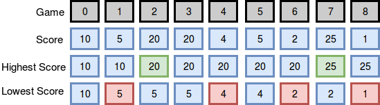
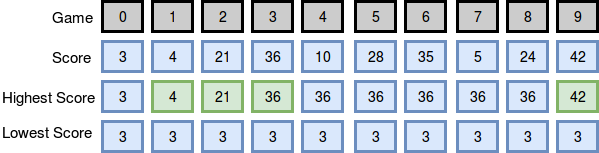

# breaking-best-and-worst-records

マリアは大学バスケットボール選手で、プロ選手を目指しています。彼女は毎シーズン、自身のプレー記録を管理しています。シーズン中に自身のシーズン記録を破った「最多得点」と「最少得点」の回数を表にまとめます。最初の試合で得点した点がそのシーズンの記録となり、そこからカウントを開始します。

例
scores = [12,24,10,24]

得点は試合の順序と同じです。彼女は結果を次のように表にまとめます：

                               回数    
試合  得点  最低得点  最高得点   最小最大
0      12     12       12     0   0
1      24     12       24     0   1
2      10     10       24     1   1
3      24     10       24     1   1

シーズン中のスコアが与えられた場合、マリアがシーズン中に最多と最少の得点を記録した回数を求めなさい。

## 関数説明

以下のエディターでbreakingRecords関数を完成させなさい。
breakingRecordsは次のパラメーターを受け取ります：
int scores［n］： 1試合あたりの得点

## 返り値

int［2］： 記録を破った回数を格納する配列。インデックスは「最多得点」記録を破った回数を、もう1つのインデックスは「最少得点」記録を破った回数を表します。

## 入力形式

1行目に試合の数を整数で入力します。
2行目にスペース区切りの整数で各試合の得点を格納します。
score0, score1, ..., scoren-1

## 制約

- 1 <= n <= 1,000
- 0 <= scores[i] <=10**8

## サンプル入力 0
``` text
9
10 5 20 20 4 5 2 25 1
```

## サンプル出力 0
``` text
2 4
```

## 説明 0

以下の図は、マリアがシーズン中に自身の最高記録と最低記録を破った回数を示しています：



彼女は最高の記録を2回（ゲーム後と）破り、最悪の記録を4回（ゲーム後、 、 、 、 ）破ったので、2 4を答えとして出力します。注意：ゲーム中、彼女のスコアは当時の最高の記録よりも厳密に大きくなかったため、彼女は最高のスコアの記録を破りませんでした。

## サンプル入力 1

``` text
10
3 4 21 36 10 28 35 5 24 42
```
## サンプル出力 1

``` text
4 0
```

## 説明 1

以下の図は、マリアがシーズン中に最高記録と最低記録を破った回数を示しています：



彼女は最高記録を4回（ゲーム ， ， ， 後に）破り、最低記録は0回（シーズン中のスコアは最初のゲームで得たスコアよりも低いものがなかったため）破らなかったため、4 0を答えとして出力します。
